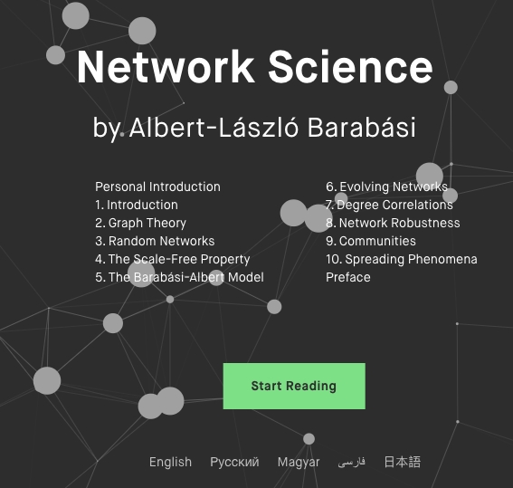

This post is about the notes I study network science [ebook](http://networksciencebook.com/).  
  

Chapter 2 Graph Theory
- The bridge of Königsberg
- Networks (node, link), refer to real system 真實存在的網路
- Graphs (vertex, edge), mathematical representation 比較偏理論
- Degree, Average Degree and Degree Distribution
- Adjacency Matrix, the **sparsity** of network implies that the adjacency matrix is also sparse.   
  
- Weighted Network, for weighted network the elements of the adjacency matrix carry the weight of the link as: *Aij = Wij*
- Metcalfe's Law: the Value of a Network [wiki](https://zh.wikipedia.org/wiki/%E6%A2%85%E7%89%B9%E5%8D%A1%E5%A4%AB%E5%AE%9A%E5%BE%8B)  
- Bipartite Networks, Tripartite Network (同組的不會相連)
- Paths and Distances
- Pathology: Path, Shortest Path
- Diameter(*dmax*) the distance between two furthest nodes or the longest shortest path in a graph.
- Eulerian Path: a path that travel each **link** exactly once.
- Hamiltonian Path: a path that travel each **node** exactly once.
- Breadth-First Search (BFS) Algorithm 
- Connectedness, bridge
- Clustering Coefficient: the degree to which the neighbors of a given node link to each other. 
- Figures with graph and adjacency matrix 